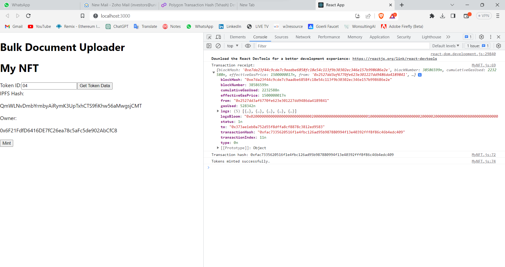

# Digital Certificates and Documents Upload with Blockchain

## Overview
The Digital Certificates and Documents Upload with Blockchain project aims to create a secure and decentralized system for storing, verifying, and sharing digital certificates and documents using blockchain technology. The project leverages the benefits of blockchain, such as immutability and transparency, to ensure the integrity and authenticity of uploaded files.

## Features
### Blockchain Integration:
Utilize blockchain technology to create a distributed ledger for storing documents and certificates securely.
Document Upload: Allow users to upload digital certificates and documents to the platform.
### Certificate Issuance: 
Implement a mechanism for issuing digital certificates with cryptographic signatures.
Verification System: Develop a verification process to authenticate the validity of certificates and documents.
### Smart Contracts: 
Utilize smart contracts to define the rules and interactions within the blockchain network.
User Authentication: Implement a secure authentication system to ensure authorized access.
### User Management: 
Provide functionalities for user registration, login, and profile management.
### Document Hashing: 
Generate and store cryptographic hashes of documents to ensure data integrity.
### Decentralization: 
Ensure that the system operates in a decentralized manner to prevent a single point of failure.

## Technologies Used
- Blockchain Platform (polygon, Ethereum, Hyperledger, etc.)
- Smart Contract Language (Solidity, etc.)
- Web3.js (or similar library) for interacting with the blockchain from the frontend.
- Node.js for backend development.
- React (or other frontend frameworks) for building the user interface.

## Installation and Setup
- Clone the repository from GitHub.
- Install the npm (Node Package Manager).
 ```
npm init -y
```
```
npm  web3
```
```
npm  axios
```
- Deploy the smart contracts on the chosen blockchain platform.
- Configure the application settings and database connection.

## To Run Testing 
Use the Following Command to run testing.

```
 npm start
```

## Screeshot of Testing

